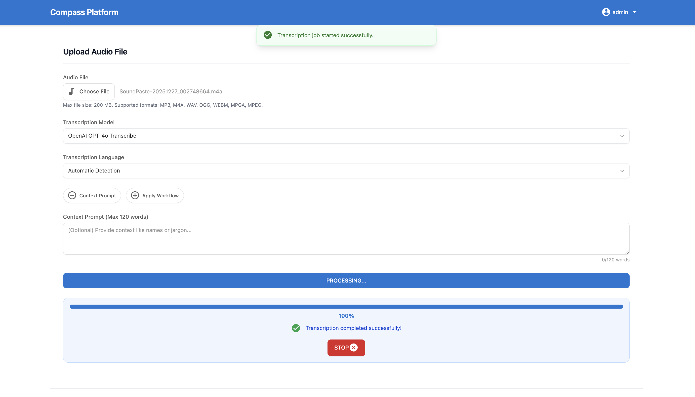

# Transcriber Platform

Transcriber Platform is a comprehensive audio transcription application featuring a user-friendly web interface. It allows users to upload audio files and obtain transcriptions using one of three supported APIs:

-   **AssemblyAI**
-   **OpenAI Whisper**
-   **OpenAI GPT-4o Transcribe**

The application intelligently handles large audio files by automatically splitting them into manageable chunks for processing. It supports both single-user (global API keys) and multi-user (individual accounts and keys) deployment modes.

## Features

-   **User-Friendly Web Interface:** A clean and intuitive interface built with HTML, CSS, and JavaScript for uploading audio files, selecting transcription models, choosing languages, providing context prompts, and managing transcription history.
-   **Multiple Transcription APIs:** Choose from AssemblyAI, OpenAI Whisper, or the new OpenAI GPT-4o Transcribe for optimal results based on your needs.
-   **Flexible Language Options:** Manually select the audio language or leverage automatic language detection for convenience.
-   **Context Prompting:** Enhance transcription accuracy for specialized terminology by providing context hints (up to 120 words) to OpenAI models.
-   **Comprehensive Transcription History:** View, copy, download (.txt format), and delete past transcriptions with ease.
-   **Large File Handling:** Audio files exceeding 25MB are automatically segmented into smaller chunks to comply with API limitations, ensuring seamless processing of large recordings.
-   **Dual Deployment Modes:**
    -   `single`: Operates with globally configured API keys, ideal for personal use or trusted environments. No user login required.
    -   `multi`: Enables user registration, login, and individual API key management.
-   **User Authentication & Management:** Secure user registration, login via username/password or Google Sign-In, and password reset functionality in `multi` user mode.
-   **Role-Based Access Control (RBAC):** Granular control over feature access, API usage, and operational limits through a flexible role and permission system in `multi` user mode.
-   **User-Specific API Key Management:** In `multi` mode, users can securely store and manage their personal API keys for AssemblyAI, OpenAI, and Google Gemini.
-   **Automated Title Generation:** AI-powered, automatic title generation for completed transcriptions using Google Gemini, enhancing organization and browsability.
-   **Workflow Engine:** Execute custom AI-driven workflows on transcribed text using configured LLMs (e.g., Google Gemini, OpenAI models) to extract insights, summarize content, or perform other NLP tasks.
-   **Saved & Template Workflows:** Users can create, save, and reuse their custom workflow prompts. Administrators can define system-wide template workflows.
-   **Admin Panel (Multi-Mode):** A dedicated interface for administrators to manage users, configure roles and permissions, view system metrics, and access application logs.
-   **Dockerized Deployment:** Simplified setup and deployment using Docker and Docker Compose, including a pre-configured MySQL database service.


*(Replace with an actual screenshot of your application)*

## Usage

1.  **Access the Application:** Open the application in your web browser.
2.  **Authentication (Multi-User Mode):**
    *   If you are a new user, register for an account.
    *   Existing users, log in with your credentials or use Google Sign-In.
    *   Navigate to "Manage API Keys" (usually via user dropdown) to add your API keys for OpenAI, AssemblyAI, and/or Google Gemini. This is required for transcription and AI features.
3.  **Upload Audio File:** Click the "File" button to select an audio file from your computer.
4.  **Select API:** Choose your preferred transcription API (AssemblyAI, OpenAI Whisper, or OpenAI GPT-4o Transcribe) from the dropdown menu.
5.  **Select Language:** Choose the language of your audio or select "Automatic Detection."
6.  **Add Context (Optional):** For OpenAI APIs, enter a context prompt (max 120 words) to improve transcription accuracy for specific terms.
7.  **Transcribe:** Click the "Transcribe" button to start the transcription process.
8.  **View History:** Your transcriptions will appear in the "Transcription History" section.
9.  **Actions on Transcriptions:**
    *   View, copy, or download the transcript text.
    *   Delete transcriptions you no longer need.
    *   **Start Workflow (if permitted):** Initiate AI-powered workflows on completed transcriptions using saved or custom prompts.

## Prerequisites

-   **API Keys:**
    You must have valid API keys for the services you intend to use:
    -   AssemblyAI (for AssemblyAI transcription)
    -   OpenAI (for Whisper, GPT-4o Transcribe, and OpenAI LLM workflows)
    -   Google Gemini (for AI-powered title generation and Gemini LLM workflows)
    Sign up at their respective websites to obtain them.
-   **Google Client ID (Multi-User Mode with Google Sign-In):**
    If deploying in `multi` user mode and enabling Google Sign-In, you need a Google Cloud Project with OAuth 2.0 credentials (Client ID).
-   **Docker & Docker Compose:**
    Ensure Docker and Docker Compose are installed and running on your machine for containerized deployment.
-   **Python 3.9+ (if developing locally):**
    Recommended for local testing and development without Docker.
-   **MySQL Server (if developing locally without Docker Compose's MySQL service):**
    A running MySQL instance is needed if you are not using the `docker-compose.yml` which includes one.

## Environment Variables

The application relies on several environment variables. These should be defined in a `.env` file in the project root. Refer to `.env.example` for a comprehensive list.

| Variable                             | Description                                                                                                | Accepted Values                                      | Default (in code if not set) |
| ------------------------------------ | ---------------------------------------------------------------------------------------------------------- | ---------------------------------------------------- | ---------------------------- |
| `SECRET_KEY`                         | **CRITICAL:** A strong, random key for session security and data encryption.                               | Any strong random string (e.g., 32 hex characters)   | (none - **must be set**)     |
| `DEPLOYMENT_MODE`                    | Application deployment mode. `multi` enables user accounts and individual API keys.                        | `single`, `multi`                                    | `multi`                      |
| `TZ`                                 | The timezone for the application.                                                                          | Any valid timezone string (e.g., `UTC`, `Europe/Paris`) | `UTC`                        |
| `APP_PORT`                           | Port on which the application will be accessible on the host machine (used by Docker Compose).             | Any valid port number                                | `5004`                       |
| `ASSEMBLYAI_API_KEY`                 | Your API key for AssemblyAI.                                                                               | Your AssemblyAI API key                              | (none)                       |
| `OPENAI_API_KEY`                     | Your API key for OpenAI (used for Whisper, GPT-4o Transcribe, and OpenAI LLMs).                            | Your OpenAI API key                                  | (none)                       |
| `GEMINI_API_KEY`                     | Your API key for Google Gemini (used for title generation and Gemini LLM workflows).                       | Your Google Gemini API key                           | (none)                       |
| `DEFAULT_TRANSCRIPTION_PROVIDER`     | The default transcription API used when the application loads.                                             | `assemblyai`, `whisper`, `gpt-4o-transcribe`         | `gpt-4o-transcribe`          |
| `DEFAULT_LLM_PROVIDER`               | The default LLM provider for general tasks like title generation.                                          | `gemini`, `openai` (or specific model names)         | `gemini`                     |
| `DEFAULT_LANGUAGE`                   | The default language for transcription on startup.                                                         | `auto`, `en`, `nl`, `fr`, `es`, etc.                 | `auto`                       |
| `SUPPORTED_LANGUAGE_CODES`           | Comma-separated list of language codes to show in the UI.                                                  | e.g., `en,nl,fr,es`                                  | `en,nl,fr,es`                |
| `MYSQL_HOST`                         | Hostname for the MySQL database server.                                                                    | e.g., `mysql` (service name in Docker), `localhost`  | `localhost`                  |
| `MYSQL_PORT`                         | Port for the MySQL database server.                                                                        | e.g., `3306`                                         | `3306`                       |
| `MYSQL_USER`                         | Username for MySQL database connection.                                                                    | Your MySQL username                                  | (none - **must be set**)     |
| `MYSQL_PASSWORD`                     | Password for MySQL database connection.                                                                    | Your MySQL password                                  | (none - **must be set**)     |
| `MYSQL_DB`                           | Name of the MySQL database.                                                                                | Your MySQL database name                             | (none - **must be set**)     |
| `MYSQL_ROOT_PASSWORD`                | Root password for the MySQL service (used by Docker Compose for initialization).                           | Your MySQL root password                             | (none)                       |
| `MYSQL_HOST_PORT`                    | Port on the host machine to map to MySQL's internal port (for external access if needed).                  | Any valid port number                                | `3307`                       |
| `MYSQL_POOL_SIZE`                    | Number of connections in the MySQL connection pool.                                                        | Integer (e.g., `10`)                                 | `10`                         |
| `ADMIN_USERNAME`                     | Username for the initial administrator account (created on first run in `multi` mode).                     | e.g., `admin`                                        | `admin`                      |
| `ADMIN_PASSWORD`                     | Password for the initial administrator account.                                                            | Your chosen strong password                          | (none - **must be set for admin creation**) |
| `ADMIN_EMAIL`                        | Email for the initial administrator account.                                                               | Your admin email address                             | (none)                       |
| `MAIL_SERVER`                        | SMTP server for sending emails (e.g., password resets).                                                    | e.g., `smtp.gmail.com`                               | (none)                       |
| `MAIL_PORT`                          | SMTP server port.                                                                                          | e.g., `587` (TLS), `465` (SSL)                       | `587`                        |
| `MAIL_USE_TLS`                       | Whether to use TLS for SMTP.                                                                               | `true`, `false`                                      | `true`                       |
| `MAIL_USE_SSL`                       | Whether to use SSL for SMTP.                                                                               | `true`, `false`                                      | `false`                      |
| `MAIL_USERNAME`                      | Username for SMTP authentication.                                                                          | Your email account username                          | (none)                       |
| `MAIL_PASSWORD`                      | Password for SMTP authentication.                                                                          | Your email account password or app password          | (none)                       |
| `MAIL_DEFAULT_SENDER`                | Default sender email address for application emails.                                                       | e.g., `noreply@example.com`                          | `noreply@example.com`        |
| `GOOGLE_CLIENT_ID`                   | Your Google OAuth 2.0 Client ID for Google Sign-In (required for `multi` mode with Google Sign-In).        | Your Google Client ID                                | (none)                       |
| `WORKFLOW_LLM_PROVIDER`              | Default LLM provider for workflow tasks.                                                                   | e.g., `gemini-2.0-flash`, `gpt-4o`                   | `gemini-2.0-flash`           |
| `WORKFLOW_MAX_OUTPUT_TOKENS`         | Maximum tokens for workflow LLM responses.                                                                 | Integer (e.g., `1024`)                               | `1024`                       |
| `WORKFLOW_RATE_LIMIT`                | Rate limit for workflow API calls per user.                                                                | e.g., `10 per hour`                                  | `10 per hour`                |
| `DELETE_THRESHOLD`                   | Age in seconds after which temporary uploaded audio files are deleted.                                     | Integer (e.g., `86400` for 24h)                      | `86400`                      |
| `PHYSICAL_DELETION_DAYS`             | Days after a transcription record is soft-deleted before it's physically removed from the database.        | Integer (e.g., `120`)                                | `120`                        |
| `LOG_LEVEL`                          | Application logging level.                                                                                 | `DEBUG`, `INFO`, `WARNING`, `ERROR`, `CRITICAL`      | `INFO`                       |
| `TRANSCRIPTION_WORKERS`              | Number of parallel workers for chunked transcription (OpenAI models). AssemblyAI uses 1.                   | Positive Integer (e.g., `4`)                         | `4`                          |

## Installation and Deployment

You have two primary options for installation and deployment:

### Option 1: Using Docker Compose (Recommended)

This is the fastest and most reliable way to get started, as it includes the MySQL database service.

1.  **Clone the Repository:**
    ```bash
    git clone https://github.com/arnoulddw/transcriber-platform
    cd transcriber-platform
    ```
    *(Replace with your actual repository URL)*

2.  **Configure Environment Variables:**
    Copy the `.env.example` file to `.env` and customize it with your `SECRET_KEY`, API keys, database credentials, admin user details, and other preferences.
    ```bash
    cp .env.example .env
    nano .env  # Or use your preferred editor
    ```
    **Important:** Ensure `MYSQL_HOST` in `.env` is set to `mysql` (the service name in `docker-compose.yml`) for the application container to connect to the MySQL container. `MYSQL_HOST_PORT` is for accessing MySQL from your host machine if needed.

3.  **Build and Run with Docker Compose:**
    From the project's root directory, run:
    ```bash
    docker-compose up -d --build
    ```
    This command will build the Docker image for the application, pull the MySQL image, and start both services. The `-d` flag runs them in detached mode.

4.  **Access the Application:**
    Open your web browser and navigate to `http://localhost:5004` (or the `APP_PORT` you configured in `.env`).

    **Initial Setup Note:** On the first run, the application will automatically initialize the database schema, create default roles, and set up the initial admin user (if in `multi` mode and `ADMIN_USERNAME`/`ADMIN_PASSWORD` are set in `.env`).

### Option 2: Using Docker Hub (If an image is published)

If a pre-built Docker image is available on Docker Hub (e.g., `arnoulddw/transcriber-platform:latest`).

1.  **Create a `.env` file** on your host machine with all necessary environment variables as described above. Ensure `MYSQL_HOST` points to your accessible MySQL server.
2.  **Ensure you have a running MySQL instance** accessible to the Docker container.
3.  **Pull the Docker Image:**
    ```bash
    docker pull arnoulddw/transcriber-platform:latest
    ```
4.  **Run the Docker Container:**
    ```bash
    docker run -d -p 5004:5004 \
      --env-file ./.env \
      --name transcriber-platform-app \
      arnoulddw/transcriber-platform:latest
    ```
    Replace `5004:5004` with `<your_host_port>:<container_port_from_env_APP_PORT>` if needed.
    This command assumes your `.env` file contains all necessary configurations, including database connection details.

### Option 3: Local Development (Without Docker)

For development or testing directly on your machine.

1.  **Clone the Repository:**
    ```bash
    git clone https://github.com/arnoulddw/transcriber-platform
    cd transcriber-platform
    ```

2.  **Set up a Python Virtual Environment:**
    ```bash
    python3 -m venv venv
    ```
    Activate it:
    -   macOS/Linux: `source venv/bin/activate`
    -   Windows: `venv\Scripts\activate`

3.  **Install Dependencies:**
    ```bash
    pip install -r requirements.txt
    ```

4.  **Set up MySQL Database:**
    Ensure you have a MySQL server running and accessible. Create a database (e.g., `transcriber_db`) and a user with permissions to access it.

5.  **Configure Environment Variables:**
    Create a `.env` file in the project root. Populate it with your `SECRET_KEY`, API keys, and **crucially, your MySQL connection details** (`MYSQL_HOST=localhost`, `MYSQL_PORT`, `MYSQL_USER`, `MYSQL_PASSWORD`, `MYSQL_DB`). Also set `ADMIN_USERNAME` and `ADMIN_PASSWORD` if you plan to use `multi` mode.

6.  **Initialize the Database Schema and Default Data:**
    From the project's root directory (with the virtual environment activated):
    ```bash
    export FLASK_APP=app  # On macOS/Linux
    # set FLASK_APP=app    # On Windows
    flask init-db
    flask create-roles
    flask create-admin # Only if in 'multi' mode and admin credentials are in .env
    ```

7.  **Run the Flask Development Server:**
    ```bash
    flask run --host=0.0.0.0 --port=5004
    ```
    *(Add `--debug` for development mode features like auto-reloading)*

8.  **Access the Application:**
    Open `http://localhost:5004` in your browser.

## Development

### Database Schema Changes

After making changes to the database schema in any of the `app/models/*.py` files, you must apply these changes by running the database migrations. This ensures that schema changes are applied incrementally and without data loss.

The `init-db` command should only be used for the very first setup on a clean database. For all subsequent schema updates, use `db-migrate`.

**For Docker Deployments:**

1.  Connect to the running application container:
    ```bash
    docker exec -it transcriber-platform bash
    ```
2.  Run the `db-migrate` command inside the container (the app container, not the database container):
    ```bash
    flask db-migrate
    ```

**For Local Development:**

1.  Ensure your virtual environment is activated:
    ```bash
    source venv/bin/activate
    ```
2.  Run the `db-migrate` command:
    ```bash
    flask db-migrate
    ```

### Translation Workflow

To add or update translations for the user interface, follow these steps. This process uses the `Flask-Babel` extension.

1.  **Activate Virtual Environment:**
    Before running any commands, ensure your Python virtual environment is active.
    ```bash
    source venv/bin/activate
    ```

2.  **Update Source Code:**
    Make any necessary text changes in the `.html` templates or `.py` files. Wrap any new user-facing strings with the `_()` function.

3.  **Extract Strings:**
    This command scans the project and updates the master `messages.pot` template file with all translatable strings.
    ```bash
    pybabel extract -F babel.cfg -k lazy_gettext -o messages.pot .
    ```

4.  **Update Language Files:**
    This command merges the new strings from the master template into the language-specific `.po` files.
    ```bash
    pybabel update -i messages.pot -d app/translations
    ```

5.  **Add Translations (Manual Step):**
    Edit the `.po` files (e.g., `app/translations/es/LC_MESSAGES/messages.po`) and fill in the translations for any entries with an empty `msgstr ""`.

6.  **Compile Translations:**
    This command converts your `.po` files into binary `.mo` files that the application uses at runtime.
    ```bash
    pybabel compile -d app/translations
    ```
    This is automatically done during the Docker image build.


## Troubleshooting

-   **Port `5004` (or configured `APP_PORT`) is in use:**
    If using Docker Compose, change the host port in the `ports` section of `docker-compose.yml` (e.g., `"5005:5004"`) or update `APP_PORT` in your `.env` file and rebuild/restart. If running locally, use `flask run --port <new_port>`.
-   **MySQL Connection Issues (Docker Compose):**
    -   Ensure the MySQL service (`mysql`) is running: `docker-compose ps`.
    -   Check MySQL logs: `docker-compose logs mysql`.
    -   Verify `MYSQL_HOST` in `.env` is `mysql` for the app container.
-   **MySQL Connection Issues (Local Development):**
    -   Ensure your MySQL server is running and accessible.
    -   Verify `MYSQL_HOST`, `MYSQL_PORT`, `MYSQL_USER`, `MYSQL_PASSWORD`, `MYSQL_DB` in your `.env` file are correct for your local MySQL setup.
-   **API Key Issues:**
    -   **Single Mode:** Ensure `ASSEMBLYAI_API_KEY`, `OPENAI_API_KEY`, `GEMINI_API_KEY` are correctly set in your `.env` file.
    -   **Multi Mode:** Ensure users have added their API keys correctly via "Manage API Keys" in the UI. Check that the keys are valid and their respective accounts are active.
-   **File Upload Issues:**
    Verify that your audio file is in a supported format (e.g., mp3, m4a, wav, webm) and not corrupted. Check browser console for errors.
-   **Google Sign-In Issues (Multi-Mode):**
    -   Ensure `GOOGLE_CLIENT_ID` is correctly set in `.env`.
    -   Verify that your Google Cloud Project's OAuth 2.0 credentials have the correct Authorized JavaScript origins (e.g., `http://localhost:5004`) and Authorized redirect URIs (e.g., `http://localhost:5004/api/auth/google-callback`).
-   **Email Sending Issues (Password Reset):**
    -   Verify `MAIL_SERVER`, `MAIL_PORT`, `MAIL_USERNAME`, `MAIL_PASSWORD`, `MAIL_DEFAULT_SENDER` in `.env` are correct for your email provider.
    -   Check if your email provider requires an "App Password" for SMTP if 2FA is enabled.
-   **Docker Errors:**
    Confirm Docker and Docker Compose are running properly and that you have the necessary permissions. Check container logs: `docker-compose logs transcriber-platform`.

## License

This project is licensed under the MIT License.